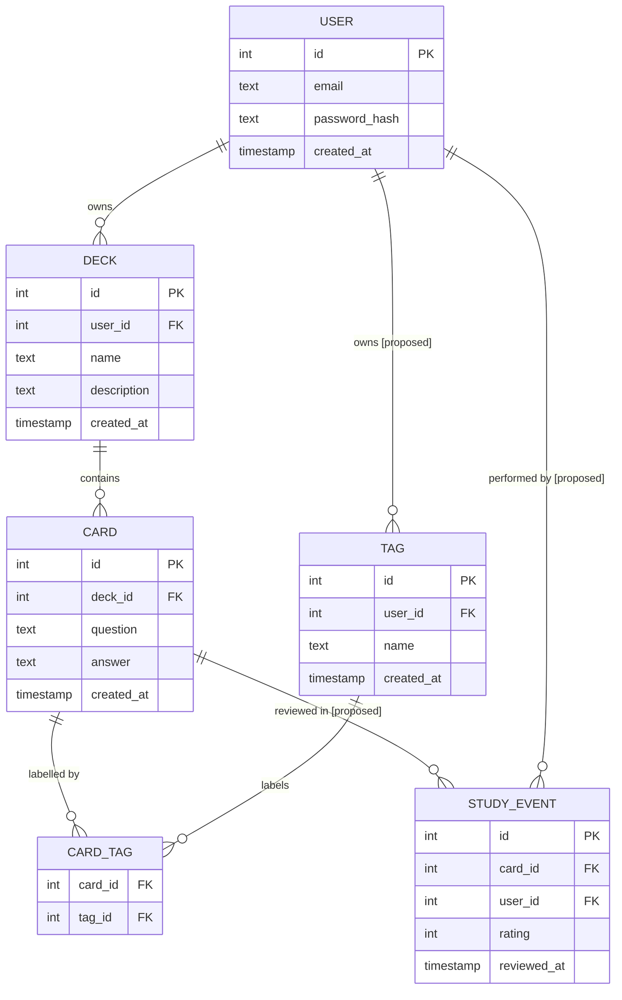

# ER Diagram: Flashcard Study Tracker

The diagram below shows both the entities that exist in the current schema and two entities that a real version would require. Elements that diverge from the current schema are annotated with **[proposed]**.

## Annotations

**USER** — not present in the current schema. A real version requires it to scope decks, tags, and study history per person. Every entity that is currently implicit-global would gain a `user_id` foreign key once this table exists.

**DECK.user_id** — not in the current schema. Proposed addition; without it, all decks are shared across all users. Once added, the uniqueness constraint on `name` should be tightened to `(user_id, name)`.

**TAG.user_id** — not in the current schema. Currently tags are a global pool shared across all cards and users. In a real version each user would own their own tags, scoped to that user's content.

**CARD_TAG** — exists in the current schema as a composite-key junction table with no additional columns. The diagram shows it as a visible structure because the many-to-many relationship between CARD and TAG cannot be represented as a direct line without it. No relationship attributes are currently needed; if the project later tracks the date a tag was applied, that date would live here.

**STUDY_EVENT** — not present in the current schema. It is the entity the application most conspicuously lacks. Each row records one review of one card by one user, with a difficulty rating (e.g. 1–5) and a timestamp. Spaced-repetition scheduling logic would query this table to determine which cards are due next.

## Reading the diagram aloud

- A user owns zero or more decks; each deck belongs to exactly one user.
- A deck contains zero or more cards; each card belongs to exactly one deck.
- A user owns zero or more tags; each tag belongs to exactly one user.
- A card is labelled by zero or more tags through CARD_TAG; a tag labels zero or more cards through CARD_TAG.
- A card is reviewed in zero or more study events; each study event records one review of one card.
- A study event is performed by exactly one user.